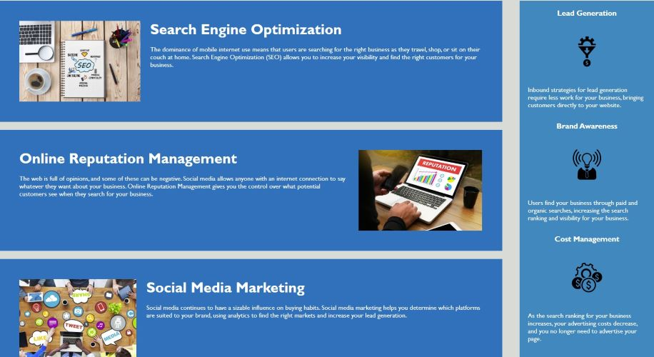

# SEO & Webperformance Project

## Description

The objective of this project is to take existing HTML code and improve it for search engine optimization and accessibility, and finally adjust image sizes for better web load-time which also effects SEO  . This can be achieved by altering the HTML of the webpage.

Some of the steps you need to improve on the webpage  include:

- Adding meta tags to for SEO purpose
- Optimize the title to describe the webpage
- Changing HTML tags to better-fitting semantic ones and for better SEO
- Resizing images to increase load times (convert all jpg images to webp format)
- Adding Alt text to images for accessibility
- Adding comments to the HTML files

## Goal with this SEO & Webperformance Project
You should use the Lighthouse tool inside Chrome Inspect Element to improve your site's loadspeed, performance and overall user experience by improving the calculated Performance score generated by Lighthouse.

You should also use the Lighthouse tool to search optimize the website by improving the calculated SEO score generated by Lighthouse. The goal is to achieve a score on SEO and Performance that is higher than 90 points

